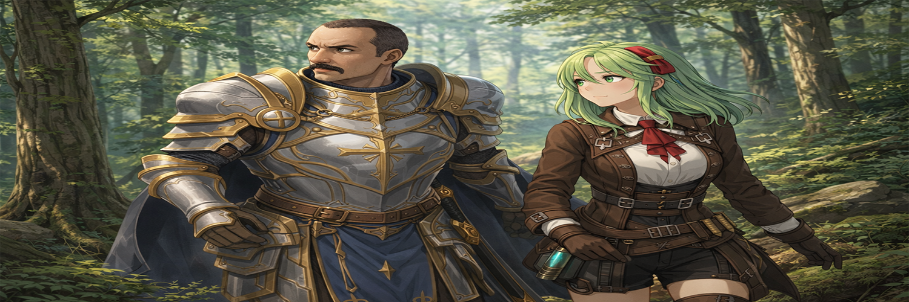

# Vivian AI

> Assistente virtual com avatar VRM animado, voz, reconhecimento de fala e automações.

---

## 📌 Sobre o Projeto

Vivian é uma assistente virtual desktop com avatar 3D animado em tempo real. Ela responde por texto ou voz, expressa emoções, executa gestos procedurais e pode disparar automações configuradas pelo usuário. O projeto combina LLM local (Ollama) ou cloud (Groq), síntese de voz (ElevenLabs + Edge TTS) e um avatar VRM 1.0 renderizado com Three.js.

---

## ✨ Funcionalidades

- 🧠 **LLM dual** — Ollama (local) ou Groq (cloud gratuito), trocável nas configurações
- 🗣️ **TTS híbrido** — ElevenLabs para respostas curtas, Edge TTS para longas (economiza créditos)
- 🎙️ **Microfone** — reconhecimento de voz em português via SpeechRecognition
- 🧍 **Avatar VRM 1.0** — animação procedural completa (respiração, sway, dedos, piscada, boca sincronizada)
- 😊 **Emoções e gestos** — detecção automática no texto, aceno, agradecimento e mais
- ⚙️ **Painel de configurações** — voz, microfone, motor TTS, motor LLM, tema, importar VRM
- 🤖 **Automações** — até 5 atalhos configuráveis por palavras-chave para abrir qualquer arquivo
- 🎨 **Temas** — Roxo, Azul, Verde e Escuro
- 💬 **Layout estilo WhatsApp** — chat com avatar circular, timestamps e balões

---

## 📁 Estrutura do Projeto

```
vivian-ai/
├── run.py                  → Entrada do programa
├── vivian/
│   ├── main.py             → Inicialização do loop asyncio
│   ├── config.py           → Chaves de API, modelo, personalidade
│   ├── llm.py              → Integração Ollama + Groq
│   ├── voice.py            → TTS ElevenLabs + Edge TTS
│   ├── listener.py         → Reconhecimento de voz (microfone)
│   ├── emotions.py         → Detecção de emoções e gestos
│   ├── automations.py      → Sistema de automações por palavras-chave
│   ├── utils.py            → Limpeza de texto para fala
│   ├── ui/
│   │   ├── avatar_window.py → API pywebview + servidor HTTP
│   │   └── vivian.html      → Interface + avatar Three.js
│   └── assets/
│       ├── vivian1.0.vrm   → Modelo VRM da Vivian
│       └── vivian_avatar.png → Avatar circular do chat
```

---

## ▶️ Como Executar

**1. Clone o repositório:**
```bash
git clone https://github.com/jeduardo-bahia/Vivian-Ai.git
cd Vivian-Ai
```

**2. Instale as dependências:**
```bash
pip install -r requirements.txt
```

**3. Configure o `config.py`:**
```python
ELEVEN_API_KEY = "sua_chave_aqui"
VOICE_ID       = "id_da_voz"
MODELO         = "gemma2:9b"  # modelo Ollama
```

**4. Execute:**
```bash
python run.py
```

---

## ⚙️ Configurações

Acesse o painel clicando em **⚙** no canto superior direito da interface.

| Opção | Descrição |
|---|---|
| Voz ativa | Liga/desliga a fala da Vivian |
| Microfone | Ativa entrada por voz |
| Motor de voz | Híbrido / ElevenLabs / Edge TTS |
| Motor de IA | Ollama (local) ou Groq (cloud) |
| Importar VRM | Carrega um novo modelo VRM 1.0 |
| Automações | Configura até 5 atalhos por palavras-chave |
| Tema | Roxo, Azul, Verde ou Escuro |

---

## 📦 Dependências

```bash
pip install pywebview ollama groq elevenlabs edge-tts pygame \
            SpeechRecognition pyaudio requests
```

Para o Groq, instale também:
```bash
pip install groq
```

---

## 🛠️ Tecnologias

- **Python 3.11+**
- **pywebview** — janela desktop com HTML/JS
- **Three.js + @pixiv/three-vrm** — renderização e animação do avatar VRM
- **Ollama** — LLM local
- **Groq API** — LLM cloud gratuito
- **ElevenLabs** — síntese de voz de alta qualidade
- **Edge TTS** — síntese de voz gratuita (Microsoft)
- **SpeechRecognition** — reconhecimento de fala
- **pygame** — reprodução de áudio

---

## 🚀 Novidades recentes

- Painel de configurações lateral com temas
- Sistema de automações com 5 slots configuráveis
- Suporte ao Groq (Llama 3.1, Llama 3.3, Mixtral, Gemma 2)
- Motor de voz híbrido (ElevenLabs + Edge TTS)
- Microfone com reconhecimento em pt-BR
- Layout de chat estilo WhatsApp com avatar circular
- Importação de modelos VRM personalizados

---

## 👨‍💻 Autor

Desenvolvido por **jeduardo-bahia**
GitHub: [github.com/jeduardo-bahia](https://github.com/jeduardo-bahia)

---

## 📄 Licença

Este projeto é de uso pessoal. Consulte o autor para outros usos.